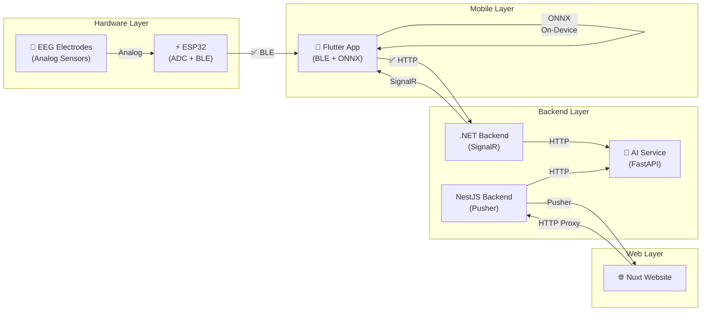

# 🎓 HazeClue — تحليل شامل + خطة إنهاء (مع ESP32)

## نظرة عامة

HazeClue — نظام متكامل لتحليل EEG في الوقت الحقيقي. **5 repositories + ESP32 firmware**:

| # | Repository | التقنية | الغرض |
|---|-----------|---------|-------|
| 1 | **HazeClue_AI** | Python (PyRiemann, sklearn) | AI — RARD-MVES v2.2 |
| 2 | **HazeClue_flutter** | Flutter/Dart | تطبيق موبايل |
| 3 | **Haze_clue_backend_mobile** | .NET 8 / C# | Backend موبايل (SQL Server) |
| 4 | **Haze_clue_backend** | NestJS / TypeScript | Backend ويب (MongoDB) |
| 5 | **Haze_clue_website** | Nuxt 4 / Vue 3 | منصة ويب للمدرسين |
| 6 | **🆕 ESP32 Firmware** | Arduino/C++ | EEG Data Acquisition + BLE |

---

## 📐 System Architecture (مع ESP32)



---

## 🔌 ESP32 — الدور في المشروع

### ايه اللي ESP32 بيحله؟

| المشكلة القديمة | الحل مع ESP32 |
|----------------|---------------|
| مفيش EEG device متاح | ESP32 ADC بيقرأ analog sensors |
| مفيش BLE code في Flutter | ESP32 بيبعت BLE → Flutter بيستقبل |
| محتاج demo حقيقي | ESP32 بيعمل real-time data stream |
| أجهزة EMOTIV غالية | ESP32 بـ $5 + electrodes بسيطة |

### ESP32 Firmware المطلوب

```
esp32_eeg_firmware/
├── src/
│   ├── main.cpp              # Entry point
│   ├── eeg_acquisition.h     # ADC sampling (128 Hz, multi-channel)
│   ├── ble_service.h         # BLE GATT Server (Custom EEG Service)
│   ├── signal_buffer.h       # Ring buffer (4-sec window = 512 samples)
│   └── config.h              # Pin mapping, sample rate, BLE UUIDs
├── platformio.ini            # PlatformIO config
└── README.md
```

### وضعين شغل:

**Mode 1 — Real Sensors (للـ demo الحقيقي):**
- ESP32 ADC بيقرأ dry electrodes (Fp1, Fp2, O1 مثلاً)
- Sample rate: 128 Hz (يتوافق مع الـ AI model)
- بيبعت raw data عبر BLE Notify

**Mode 2 — Simulated EEG (للتطوير والعرض):**
- ESP32 بيولد synthetic EEG (Alpha/Beta waves + noise)
- بيتنقل بين "focused" و "relaxed" patterns بـ button press
- مثالي لو الـ electrodes مش جاهزة

### BLE Protocol:

| Service UUID | Characteristic | الوظيفة |
|-------------|----------------|---------|
| `0xFFE0` | `0xFFE1` (Notify) | EEG data stream (20 bytes/packet) |
| `0xFFE0` | `0xFFE2` (Read) | Device info + battery |
| `0xFFE0` | `0xFFE3` (Write) | Commands (start/stop/mode) |

**Packet Format (20 bytes):**
```
[0]     = channel count (1-14)
[1]     = sequence number
[2-3]   = sample 1 (16-bit signed)
[4-5]   = sample 2
...
[18-19] = sample 9
```

---

## 📊 حالة كل مكوّن

### 1️⃣ AI (85% ✅)

**شغال:** Data loaders, Preprocessing (bandpass, SQI, covariance, wavelet, alignment), Routing, Features (RARD 105 + MVES 203 + CSP), Training (v1+v2), Inference engine, Personalization, ONNX export (مكتوب)

**النتائج:** Within: 99.6% | Adaptive: 83.5% | Cross: 78.6%

**ناقص:**
- ❌ `api/inference_endpoint.py` — FastAPI endpoint
- ⚠️ ONNX export لم يُختبر
- ❌ Tests فاضية
- ❌ Confusion Matrix / ROC visualizations

### 2️⃣ Flutter (80% ✅)

**شغال:** 30 شاشة كاملة (Auth, Dashboard, Sessions, Insights, Training, Profile, Devices, tDCS, Notifications, Settings, Help). خدمات: API (45 method), SignalR, Smartwatch.

**ناقص:**
- ❌ BLE service لاستقبال ESP32 data → **أولوية #1 الآن**
- ❌ ONNX Runtime on-device inference
- ❌ Live session مع AI حقيقي
- ⚠️ No state management (StatefulWidget only)

### 3️⃣ .NET Backend Mobile (75% ✅)

**شغال:** 11 controllers, 14 entities, SignalR Hub, Clean Architecture, Swagger, Docker

**ناقص:**
- ❌ AI Service proxy (HTTP client → FastAPI)
- ⚠️ Tests فاضية
- ⚠️ Email service غير واضح

### 4️⃣ NestJS Backend Web (80% ✅)

**شغال:** 12 modules (Auth+OAuth, Sessions, Devices, Reports+PDF, Dashboard, Gateway, Notifications, Pusher, Support), Rate limiting, Helmet, Nodemailer

**ناقص:**
- ❌ AI Service proxy
- ⚠️ Reports مع mock data
- ⚠️ Telemetry بيخزن بس مش بيحلل

### 5️⃣ Nuxt Website (85% ✅)

**شغال:** Landing (GSAP), Auth flow, Dashboard, Sessions, Devices, Live Session, Reports, Profile, Settings, Help. i18n AR/EN, Dark mode, Pusher, Pinia, Zod.

**ناقص:**
- ⚠️ Live visualization بـ simulated data
- ❌ Heatmap visualization
- ⚠️ Student group management جزئي

---

## 🔴 الأولويات الحرجة (مع ESP32)

> [!CAUTION]
> ### Top 6 — لازم قبل المناقشة:

### 1. 🆕 ESP32 Firmware (3-4 ساعات)
```
المطلوب:
  - Arduino/PlatformIO project
  - ADC sampling على pin واحد أو أكتر (128 Hz)
  - BLE GATT server مع Notify characteristic
  - وضع Simulation (synthetic Alpha/Beta waves)
  - وضع Real (ADC input)
```

### 2. 🆕 Flutter BLE Service (3-4 ساعات)
```
المطلوب:
  - إضافة flutter_blue_plus في pubspec.yaml
  - BLE scan + connect لـ ESP32
  - استقبال EEG packets + parsing
  - تخزين في ring buffer (4-sec window)
  - عرض real-time waveform
```

### 3. FastAPI Inference Endpoint (2-3 ساعات)
```
المكان: HazeClue_AI/api/inference_endpoint.py
المطلوب: POST /predict يستقبل EEG window → يرد classification
```

### 4. End-to-End Demo Flow (3-4 ساعات)
```
ESP32 → BLE → Flutter → HTTP → .NET Backend → FastAPI AI → Result → Flutter UI
ده أهم حاجة في المناقشة!
```

### 5. Evaluation Visualizations (2-3 ساعات)
```
Confusion Matrix, ROC Curve, Feature Importance
مطلوب للعرض
```

### 6. Documentation Update (2-3 ساعات)
```
تحديث READMEs + system architecture + ESP32 docs
```

---

## 🟡 أولوية متوسطة

| # | المهمة | التقدير |
|---|--------|---------|
| 7 | ONNX Export + Verification | 1-2 ساعات |
| 8 | ONNX Runtime في Flutter | 3-4 ساعات |
| 9 | AI Proxy في .NET Backend | 2-3 ساعات |
| 10 | AI Proxy في NestJS Backend | 2-3 ساعات |
| 11 | Unit Tests للـ AI Pipeline | 3-4 ساعات |

## 🟢 أولوية منخفضة

| # | المهمة | التقدير |
|---|--------|---------|
| 12 | Heatmap Visualization للموقع | 4-5 ساعات |
| 13 | EEGNet Deep Learning | 4-6 ساعات |
| 14 | Offline support في Flutter | 3-4 ساعات |
| 15 | Docker Compose لكل الخدمات | 2-3 ساعات |
| 16 | Multi-channel ESP32 (3+ electrodes) | 3-4 ساعات |

---

## ⏱️ تقدير الوقت

| الأولوية | المهام | الوقت |
|---------|--------|-------|
| 🔴 حرجة | #1-6 | **16-21 ساعة** |
| 🟡 متوسطة | #7-11 | **12-16 ساعة** |
| 🟢 منخفضة | #12-16 | **17-22 ساعة** |

> [!IMPORTANT]
> لو المناقشة الأسبوع الجاي → ركز على **#1-6 فقط** (16-21 ساعة = 3-4 أيام شغل مركّز).
> **الأهم من كل ده: الـ End-to-End Demo (#4)** — ده اللي هيبهر اللجنة.

---

## 💡 نصائح للمناقشة

> [!TIP]
> ### نقاط قوة مع ESP32:

1. **Hardware Integration** — ESP32 كـ EEG acquisition device بيوريهم إنك فاهم embedded systems
2. **Full IoT Pipeline** — Sensors → Microcontroller → BLE → Mobile → Cloud → AI → Web
3. **Cost-effective** — ESP32 ($5) vs EMOTIV ($300+) — ممكن تقدمها كـ affordable BCI solution
4. **Hybrid AI (RARD-MVES)** — contribution أصيلة
5. **78.6% Cross-Subject** — ممتاز مقارنة بالأبحاث

> [!WARNING]
> ### أسئلة متوقعة:

1. "ايه دقة الـ ESP32 ADC مقارنة بأجهزة EEG الاحترافية؟" — 12-bit ADC, كافي لـ proof of concept, الموديل trained على EMOTIV (14-bit) فالنتائج هتكون تقريبية
2. "ليه 2 backends؟" — .NET للموبايل (team skill) + NestJS للويب (modern stack)
3. "ازاي بتتعامل مع noise في ESP32?" — Butterworth bandpass + DWT wavelet denoising

---

## Open Questions

1. **ESP32 — كام channel محتاج؟** لو channel واحد (Fp1) كفاية للـ demo. لو محتاج multi-channel هنحتاج ADS1299 module
2. **عندك dry electrodes جاهزة ولا هنستخدم simulated mode بس؟**
3. **المناقشة presentation + live demo ولا presentation بس؟**
4. **هل الـ trained models (.joblib) موجودين ولا محتاج تعيد التدريب؟**
